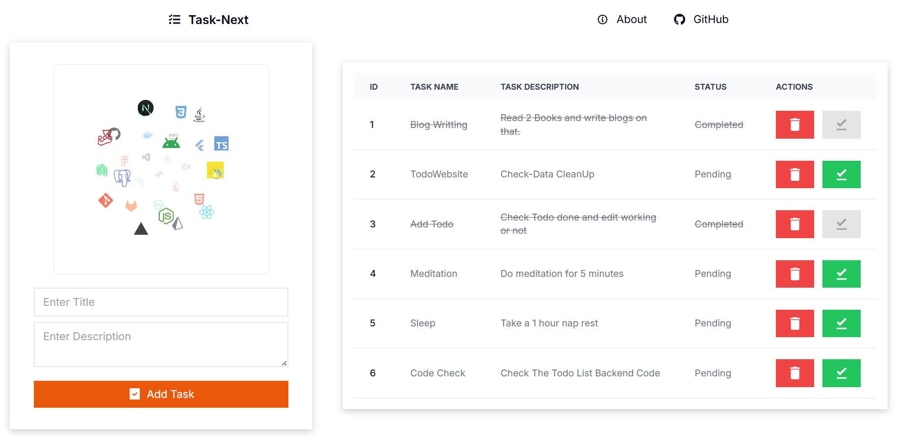

# 📝 TaskNext - Simple To Do List

TaskNext is a minimalistic website designed to help you manage your tasks efficiently. It provides a simple and intuitive interface for users to create, read, update, and delete tasks, as well as mark tasks as complete.

## Features

- **CRUD Operations**: Create, read, update, and delete tasks with ease.
- **Complete Task Button**: Mark tasks as complete with a single click.
- **Minimalistic Design**: Focus on your tasks without distractions from unnecessary elements.
- **Real-time Updates**: Experience real-time updates with Next.js and MongoDB.

## Installation

To use TaskNext, simply visit the website [https://tasknext.com](https://tasknext.com) and start managing your tasks right away. No installation or additional software is required.

## Usage

1. Visit the TaskNext website [https://tasknext.com](https://tasknext.com).
2. Add new tasks using the input field and "Add Task" button.
3. View your tasks in the task list.
4. Edit or delete tasks using the respective buttons.
5. Mark tasks as complete using the "Complete" button.

## Contributing

Contributions to TaskNext are welcome! If you have any suggestions, bug reports, or feature requests, please submit them to our GitHub repository [https://github.com/tasknext](https://github.com/Sumonta056/TaskNext-Simple-To-Do-List). We appreciate your feedback and contributions.

## License

TaskNext is released under the [MIT License](https://opensource.org/licenses/MIT). Feel free to use, modify, and distribute the code as per the terms of the license.
